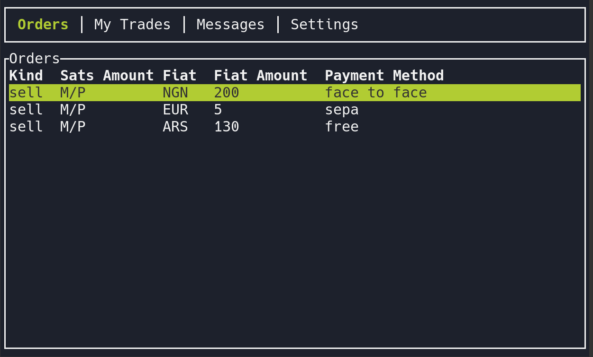

# MostriX

MostriX es un cliente de Mostro con interfaz TUI (Terminal User Interface) enfocado principalmente en administradores de nodos de Mostro. Su interfaz visual en terminal permite gestionar disputas y administrar el nodo de forma ágil, sin necesidad de escribir comandos manualmente.



```admonish note
MostriX está en desarrollo activo. Algunas funcionalidades pueden estar incompletas o requerir pruebas adicionales.
```

## Instalación

```bash
git clone https://github.com/MostroP2P/mostrix.git
cd mostrix
cargo run
```

Requisitos: Rust 1.90 o superior.

## Características implementadas

- Visualizar libro de órdenes
- Crear órdenes de compra y venta
- Crear órdenes de compra con Lightning Address
- Tomar órdenes (compra y venta)
- Confirmar fiat enviado
- Liberar sats
- Agregar nueva invoice si el pago falla
- Generación automática de semilla de 12 palabras
- Gestión de llaves según el protocolo Mostro
- Configuración mediante archivo settings.toml

## Características en desarrollo

- Chat peer-to-peer
- Listar órdenes propias
- Cancelación cooperativa
- Calificar contrapartes
- Flujo de disputas

## Configuración

MostriX se configura mediante un archivo `settings.toml`. En la primera ejecución, se crea automáticamente en `~/.mostrix/settings.toml`.

Parámetros principales:

- `mostro_pubkey`: Clave pública del nodo de Mostro
- `nsec_privkey`: Tu clave privada de Nostr
- `relays`: Lista de relays a conectar
- `currencies`: Monedas fiat que te interesan

## Más información

MostriX es un proyecto FOSS. Puedes visitar su [repositorio en GitHub](https://github.com/MostroP2P/mostrix) para conocer más sobre su desarrollo, reportar bugs o proponer mejoras.
