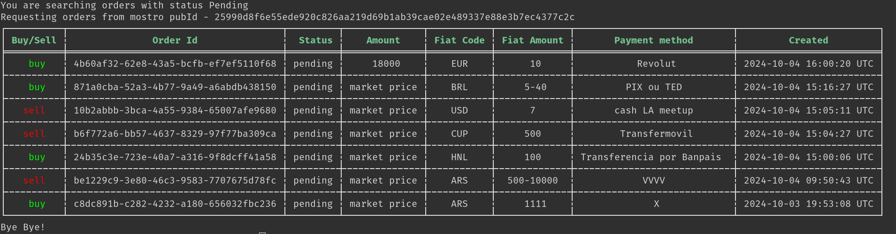

# Mostro CLI

Mostro CLI es un cliente de Mostro con interfaz de línea de comandos. Es utilizado principalmente por desarrolladores y usuarios avanzados para probar las últimas funcionalidades de Mostro y para automatizar operaciones.



## Instalación

Puedes instalar Mostro CLI directamente desde crates.io:

```bash
cargo install mostro-cli
```

O compilarlo manualmente:

```bash
git clone https://github.com/MostroP2P/mostro-cli.git
cd mostro-cli
cargo build --release
```

Requisitos: Rust 1.64 o superior.

## Características

- Crear órdenes de compra y venta
- Tomar órdenes del libro de ofertas
- Soporte para órdenes de rango (min-max)
- Crear órdenes de compra con Lightning Address
- Chat directo con contrapartes (NIP-17)
- Gestión de identidad (soporte NIP-06)
- Flujo completo de disputas
- Restaurar sesión para recuperar órdenes pendientes
- Comandos de administración para operadores de Mostro

## Uso básico

```bash
# Configurar variables de entorno
export MOSTRO_PUBKEY=npub1stagewtcks78nvs4vkzm4skqzytk5gwj46kkm8mu2awqqklgswgqfvtamr
export RELAYS='wss://relay.mostro.network,wss://nos.lol'

# Listar órdenes disponibles
mostro-cli listorders

# Crear una orden de compra
mostro-cli neworder -k buy -c ves -f 1000 -m "face to face"

# Crear una orden de venta con rango
mostro-cli neworder -k sell -c ars -f 1000-10000 -m "transferencia bancaria"

# Cancelar una orden pendiente
mostro-cli cancel -o <order-id>

# Restaurar sesión
mostro-cli restore
```

Para ver todos los comandos disponibles:

```bash
mostro-cli help
```

## Más información

Mostro CLI es un proyecto FOSS. Puedes visitar su [repositorio en GitHub](https://github.com/MostroP2P/mostro-cli) para conocer más sobre su desarrollo, reportar bugs o proponer mejoras.
